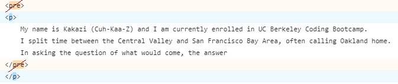

# Personal Portfolio - Module 2, Mar 27

## Description
The aim of this project is to create a landing page for a portfolio. This is to be the starting point for a portfolio that will help with employment quests after the bootcamp is completed. While currently a landing page, once assignments are completed, it will be edited to showcase knowledge and growth.

[Live Link](https://kkitenge.github.io/kgkportfolio/)

## Code discovery
While working on a section of the page, issues arose when the screen would be minimized to a mobile viewing setting. The text would stretch out beyond the containter it was attached to, causing a horizontal scroll bar at the bottom of the screen, as content was pushed out to the right-hand side.

The original HTML was written as:

It was found out to be that *p* would work better thatn *pre* and be recognized in a way that would work with both the container and action so that no other elements were affected and the desired result shown. 

## Credit

* Assitance with from @AskBCS Learning Assitant #ask-238630.
* [W3Schools.com](https://www.w3schools.com)
* [Visual Studio Code](https://code.visualstudio.com)
* [GitHub](https://github.com)

